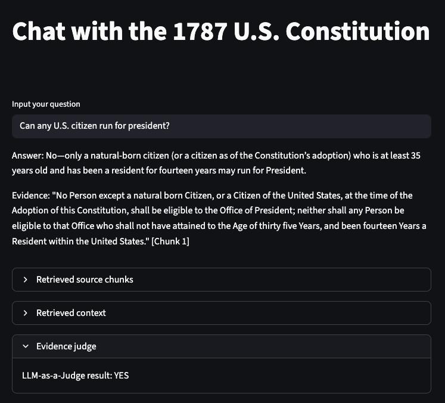
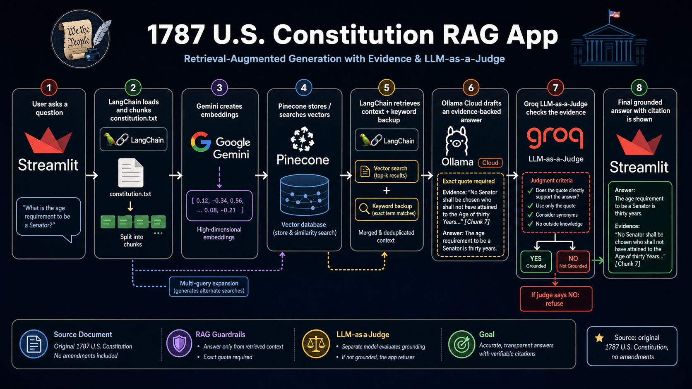

# hybrid-rag-app

https://us-constitution.streamlit.app/

<a href="assets/screenshot.png" target="_new">

</a>
<br><br>
This project is a small Streamlit app that lets you ask questions about a local text document using LangChain, Pinecone, Google Gemini embeddings, an Ollama Cloud-hosted chat model, and a Groq-hosted evidence judge.

The app currently loads `constitution.txt`, splits it into chunks, creates embeddings with Google's `gemini-embedding-001`, stores them in a Pinecone vector index, drafts answers with `gpt-oss:120b` through the Ollama Cloud API, and uses Groq `llama-3.1-8b-instant` to judge whether the cited evidence supports the answer.

Streamlit is a Python framework for quickly building interactive web apps for data and AI projects. Learn more at https://streamlit.io/.

Below is a diagram to help visualize the architecture:

[](https://raw.githubusercontent.com/reyarqueza/ollama-crash-course/main/assets/rag-implementation-flow.png)

## Stack Overview

This is a **hybrid RAG** app.

RAG means Retrieval-Augmented Generation: the app retrieves relevant chunks from `constitution.txt`, passes those chunks into the prompt, and asks the chat model to answer only from that context.

It is hybrid because retrieval uses two approaches:

- **Vector retrieval:** Google `gemini-embedding-001` converts document chunks and questions into vectors. Pinecone searches for semantically similar chunks.
- **Keyword backup:** The app also scans chunks for exact words from the question. This helps with questions where exact terms matter, such as `Senator`.

The app also uses a multi-query retrieval step, which asks the chat model to generate alternate versions of the user's question before vector search. That can improve recall when the user's wording does not closely match the document.

After the Ollama chat model drafts an answer, the app sends the question, answer, and exact evidence quote to a separate Groq judge model. The judge decides whether the quote directly supports the answer. If the judge says no, the app replaces the answer with `I do not know based on the provided document.`

| Layer | Tool / Model | Open Source? | Where It Runs |
| --- | --- | --- | --- |
| UI | Streamlit | Open source | Locally during development, or on Streamlit Community Cloud if deployed |
| Orchestration | LangChain | Open source | In the Streamlit Python process |
| Vector database | Pinecone | No, hosted vector database | Pinecone cloud |
| Embeddings | Google `gemini-embedding-001` | No, proprietary Google model | Google Gemini API / Google AI Studio cloud |
| Chat model | OpenAI `gpt-oss:120b` via Ollama Cloud | Open-weight model under Apache 2.0; served here by Ollama | Ollama Cloud |
| Evidence judge | Meta `llama-3.1-8b-instant` via Groq | Open-weight model; served here by Groq | Groq Cloud |

Notes:

- `gpt-oss:120b` is an open-weight OpenAI model available under the Apache 2.0 license, but in this app it is not running locally. The app calls Ollama's hosted Cloud API.
- `llama-3.1-8b-instant` is used only as a judge. It does not draft the final answer; it checks whether the answer's quote directly supports the answer.
- `gemini-embedding-001` is not open source. It is a proprietary Google embedding model accessed through a Gemini API key.
- Pinecone stores the vectors in the `constitution-rag` index under the `constitution` namespace. The source document remains `constitution.txt`.
- The app uses Pinecone's official Python SDK directly instead of `langchain-pinecone`. The local virtual environment is currently Python 3.14, while `langchain-pinecone==0.2.13` requires Python `<3.14`, so the direct SDK keeps this crash-course app installable in the current environment.

## Tools

| Tool | URL |
| --- | --- |
|  Ollama | https://ollama.com/ |
|  Groq | https://groq.com/ |
|  Google AI Studio / Gemini API | https://ai.google.dev/ |
|  LangChain | https://www.langchain.com/ |
|  Pinecone | https://www.pinecone.io/ |
|  Streamlit | https://streamlit.io/ |

## Requirements

Before running the app, make sure you have:

- Python 3.14 recommended; this project is currently tested with the local `.venv` on Python 3.14
- An Ollama API key
- A Groq API key
- A Google AI Studio / Gemini API key
- A Pinecone API key

```
At the time of writing, Ollama, Groq, Google, and Pinecone have free tiers.
```

You do not need a local Ollama server for the current version of this app. The chat model runs through the Ollama Cloud API, the evidence judge runs through Groq, embeddings run through the Gemini API, and vector storage/search runs through Pinecone.

## 1. Create API Keys

Create an Ollama API key from your Ollama account:

https://ollama.com/

Create a Gemini API key from Google AI Studio:

https://ai.google.dev/

Create a Groq API key from GroqCloud:

https://console.groq.com/keys

Create a Pinecone API key from your Pinecone account:

https://www.pinecone.io/

## 2. Clone or Open the Project

If you already have this project locally, open a terminal in the project directory:

```bash
cd /path/to/ollama-crash-course
```

## 3. Create a Virtual Environment

Create a Python virtual environment:

```bash
python3 -m venv .venv
```

Activate it:

```bash
source .venv/bin/activate
```

On Windows PowerShell, use:

```powershell
.venv\Scripts\Activate.ps1
```

## 4. Install Python Dependencies

Install the required packages:

```bash
pip install -r requirements.txt
```

## 5. Add Local Secrets

Create a local Streamlit secrets file:

```bash
mkdir -p .streamlit
```

Then add your API keys to `.streamlit/secrets.toml`:

```toml
OLLAMA_API_KEY = "your_ollama_api_key"
GROQ_API_KEY = "your_groq_api_key"
GEMINI_API_KEY = "your_gemini_api_key"
PINECONE_API_KEY = "your_pinecone_api_key"
```

This file is ignored by git so your keys do not get committed.

## VS Code Setup

This project includes `.vscode/settings.json`, so VS Code should automatically use the local virtual environment at `.venv/bin/python` when you open the folder.

If VS Code still shows squiggly lines under imports after installing dependencies, reload the window:

1. Open the Command Palette again.
2. Search for and select `Developer: Reload Window`.

If the squiggly lines remain, open the Command Palette, select `Python: Select Interpreter`, and choose `.venv/bin/python`.

## 6. Run the App

Start the Streamlit app:

```bash
streamlit run hybrid_rag_app.py
```

Streamlit will print a local URL, usually:

```text
http://localhost:8501
```

Open that URL in your browser, type a question, and the app will answer using the contents of `constitution.txt`.

When the app starts, it embeds the document chunks with Google Gemini, creates the Pinecone index if needed, upserts the chunks into Pinecone, and waits for your question. For each question, Ollama drafts an evidence-backed answer and Groq judges whether the evidence directly supports it.

## Example Questions

Try asking:

- What is the purpose of the Constitution?
- What powers does Congress have?
- How can the Constitution be amended?
- What does the document say about the President?

You can also test whether the app avoids answering from the model's general knowledge:

| Question | Expected Answer |
| --- | --- |
| What does the 22nd Amendment say about presidential term limits? | The app should say it does not know based on the provided document, because this `constitution.txt` file does not include the 22nd Amendment. |

## Project Files

- `hybrid_rag_app.py` - Main Streamlit application
- `constitution.txt` - Source document used by the app
- `requirements.txt` - Python dependencies
- `CDOC-110hdoc50.pdf` - Original PDF source included in the project

## Troubleshooting

If you see an error about `OLLAMA_API_KEY`, make sure `.streamlit/secrets.toml` contains:

```toml
OLLAMA_API_KEY = "your_ollama_api_key"
```

If you see an error about `GROQ_API_KEY`, make sure `.streamlit/secrets.toml` contains:

```toml
GROQ_API_KEY = "your_groq_api_key"
```

If you see an error about `GEMINI_API_KEY`, make sure `.streamlit/secrets.toml` contains:

```toml
GEMINI_API_KEY = "your_gemini_api_key"
```

If you see an error about `PINECONE_API_KEY`, make sure `.streamlit/secrets.toml` contains:

```toml
PINECONE_API_KEY = "your_pinecone_api_key"
```

If Google reports that an embedding model is unavailable, check that `hybrid_rag_app.py` is using:

```python
EMBEDDING_MODEL = "models/gemini-embedding-001"
```

If Python packages are missing, make sure your virtual environment is activated, then run:

```bash
pip install -r requirements.txt
```

If Streamlit is not found, run it through Python:

```bash
python -m streamlit run hybrid_rag_app.py
```

## References

- Ollama `gpt-oss` model page: https://ollama.com/library/gpt-oss
- OpenAI `gpt-oss` open-weight model overview: https://help.openai.com/en/articles/11870455
- LangChain Groq integration docs: https://docs.langchain.com/oss/python/integrations/chat/groq
- Groq supported models: https://console.groq.com/docs/models
- Google Gemini embeddings docs: https://ai.google.dev/gemini-api/docs/embeddings
- Pinecone Python SDK docs: https://docs.pinecone.io/reference/python-sdk
